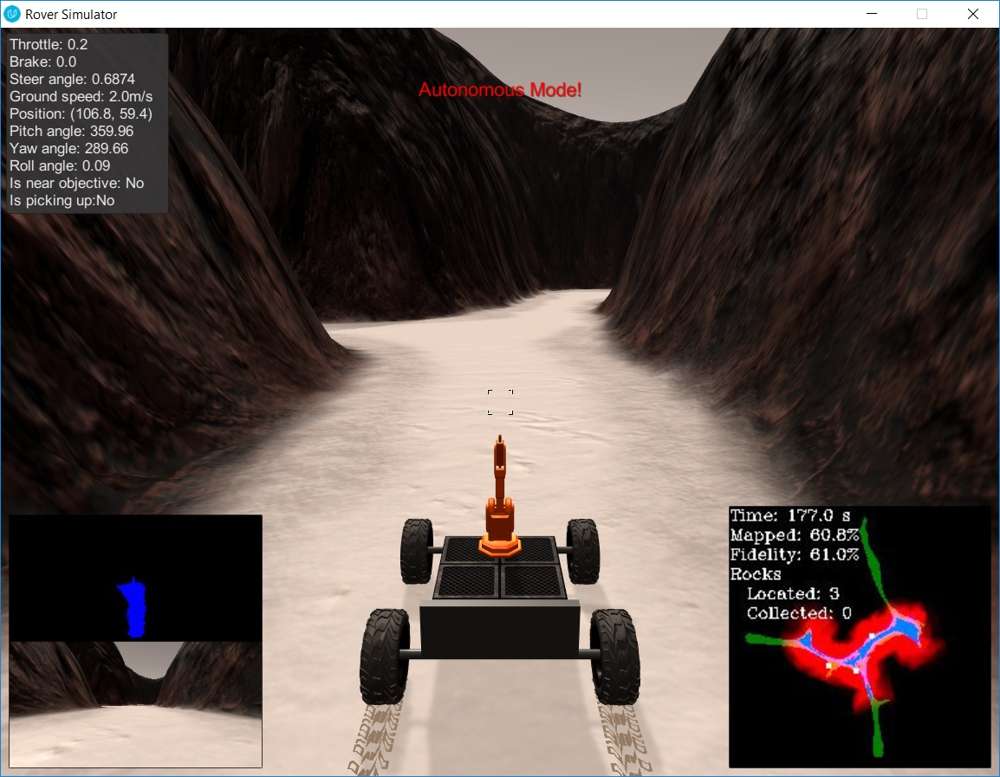

## Project: Search and Sample Return
### Writeup Template: You can use this file as a template for your writeup if you want to submit it as a markdown file, but feel free to use some other method and submit a pdf if you prefer.

---


**The goals / steps of this project are the following:**  

**Training / Calibration**  

* Download the simulator and take data in "Training Mode"
* Test out the functions in the Jupyter Notebook provided
* Add functions to detect obstacles and samples of interest (golden rocks)
* Fill in the `process_image()` function with the appropriate image processing steps (perspective transform, color threshold etc.) to get from raw images to a map.  The `output_image` you create in this step should demonstrate that your mapping pipeline works.
* Use `moviepy` to process the images in your saved dataset with the `process_image()` function.  Include the video you produce as part of your submission.

**Autonomous Navigation / Mapping**

* Fill in the `perception_step()` function within the `perception.py` script with the appropriate image processing functions to create a map and update `Rover()` data (similar to what you did with `process_image()` in the notebook). 
* Fill in the `decision_step()` function within the `decision.py` script with conditional statements that take into consideration the outputs of the `perception_step()` in deciding how to issue throttle, brake and steering commands. 
* Iterate on your perception and decision function until your rover does a reasonable (need to define metric) job of navigating and mapping.  

[//]: # (Image References)

[image1]: ./misc/rover_image.jpg
[image2]: ./calibration_images/example_grid1.jpg
[image3]: ./calibration_images/example_rock1.jpg 

## [Rubric](https://review.udacity.com/#!/rubrics/916/view) Points
### Here I will consider the rubric points individually and describe how I addressed each point in my implementation.  

---
### Writeup / README

#### 1. Provide a Writeup / README that includes all the rubric points and how you addressed each one.  You can submit your writeup as markdown or pdf.  

You're reading it!

### Notebook Analysis
#### 1. Run the functions provided in the notebook on test images (first with the test data provided, next on data you have recorded). Add/modify functions to allow for color selection of obstacles and rock samples.
Since the navigable pixels are mostly bright white, checking if all the channels separately are above a threshold feels like a valid a approach. The thresholds themselves are overridable. The way to set these values is to look at each channel separately and the value for that channel is the mid-point between the darkest part of the navigable area and the lightest part of the non-navigable area. 

The idea is to maximize the distance of the decision threshold to both classes.

```
def color_thresh(img, rgb_thresh=(160, 160, 160)):
    # Create an array of zeros same xy size as img, but single channel
    color_select = np.zeros_like(img[:,:,0])
    # Require that each pixel be above all three threshold values in RGB
    # above_thresh will now contain a boolean array with "True"
    # where threshold was met
    above_thresh = (img[:,:,0] > rgb_thresh[0]) \
                & (img[:,:,1] > rgb_thresh[1]) \
                & (img[:,:,2] > rgb_thresh[2])
    # Index the array of zeros with the boolean array and set to 1
    color_select[above_thresh] = 1
    # Return the binary image
    return color_select
```

#### 1. Populate the `process_image()` function with the appropriate analysis steps to map pixels identifying navigable terrain, obstacles and rock samples into a worldmap.  Run `process_image()` on your test data using the `moviepy` functions provided to create video output of your result. 
In process_image(), I apply the different functions as they were explained in the course. We apply the same transform for all channels. Afterward, each channel are processed separetely and the results will be put together toward the end. Thresholds are similar except for rocks. The threshold strategy is a bit different because rocks are not white. One of the channel should be dark but the rest should be light. Using this, we can decide if a pixel represents a navigable terrain, an obstacle or a rock.

Then, converting pixel coordinates to rover-centric coordinates, then to to world coordinates. Using this to update the world map.

```
def process_image(img):
    # Example of how to use the Databucket() object defined above
    # to print the current x, y and yaw values 
    # print(data.xpos[data.count], data.ypos[data.count], data.yaw[data.count])

    # TODO: 
    # 1) Define source and destination points for perspective transform
    dst_size = 5 
    scale = (2.*dst_size)
    # Set a bottom offset to account for the fact that the bottom of the image 
    # is not the position of the rover but a bit in front of it
    # this is just a rough guess, feel free to change it!
    bottom_offset = 6
    source = np.float32([[14, 140], [301 ,140],[200, 96], [118, 96]])
    destination = np.float32([[image.shape[1]/2 - dst_size, image.shape[0] - bottom_offset],
                      [image.shape[1]/2 + dst_size, image.shape[0] - bottom_offset],
                      [image.shape[1]/2 + dst_size, image.shape[0] - 2*dst_size - bottom_offset], 
                      [image.shape[1]/2 - dst_size, image.shape[0] - 2*dst_size - bottom_offset],
                      ])
    
    # 2) Apply perspective transform
    img_warped, mask_warped = perspect_transform(img, source, destination)
    
    # 3) Apply color threshold to identify navigable terrain/obstacles/rock samples
    img_threshed = color_thresh(img_warped, rgb_thresh=(168, 188, 173))
    obs_map = np.absolute(np.float32(img_threshed) - 1) * mask
    rock_map = find_rocks(img_warped, levels=(110, 110, 50))
    
    # 4) Convert thresholded image pixel values to rover-centric coords
    xpix, ypix = rover_coords(img_threshed)
    obs_xpix, obs_ypix = rover_coords(obs_map)
    if rock_map.any():
        rock_x, rock_y = rover_coords(rock_map)

    # 5) Convert rover-centric pixel values to world coords
    x_pix_world, y_pix_world = pix_to_world(
        xpix, ypix, 
        data.xpos[data.count], data.ypos[data.count], data.yaw[data.count], 
        data.worldmap.shape, scale)
    
    obs_x_pix_world, obs_y_pix_world = pix_to_world(
        obs_xpix, obs_ypix, 
        data.xpos[data.count], data.ypos[data.count], data.yaw[data.count], 
        data.worldmap.shape, scale) 
    
    if rock_map.any():
        rock_x_world, rock_y_world = pix_to_world(
            rock_x, rock_y, 
            data.xpos[data.count], data.ypos[data.count], data.yaw[data.count], 
            data.worldmap.shape, scale) 
        
    # 6) Update worldmap (to be displayed on right side of screen)
        # Example: data.worldmap[obstacle_y_world, obstacle_x_world, 0] += 1
        #          data.worldmap[rock_y_world, rock_x_world, 1] += 1
        #          data.worldmap[navigable_y_world, navigable_x_world, 2] += 1
    #print("x_pix_world:{}, y_pix_world:{}".format(x_pix_world.shape, y_pix_world.shape))
    #for i in range(x_pix_world.shape[0]):
    #    data.worldmap[y_pix_world[i], x_pix_world[i]] = [255, 0, 0]
    data.worldmap[y_pix_world, x_pix_world, 2] = 255
    data.worldmap[obs_y_pix_world, obs_x_pix_world, 0] = 255
    nav_pix = data.worldmap[:,:,2] > 0
    data.worldmap[nav_pix,0] = 0
    
    if rock_map.any():
        data.worldmap[rock_y_world, rock_x_world, 1] = 255
    

    # 7) Make a mosaic image, below is some example code
        # First create a blank image (can be whatever shape you like)
    output_image = np.zeros((img.shape[0] + data.worldmap.shape[0], img.shape[1]*2, 3))
        # Next you can populate regions of the image with various output
        # Here I'm putting the original image in the upper left hand corner
    output_image[0:img.shape[0], 0:img.shape[1]] = img

        # Let's create more images to add to the mosaic, first a warped image
    warped = perspect_transform(img, source, destination)
        # Add the warped image in the upper right hand corner
    output_image[0:img.shape[0], img.shape[1]:] = img_warped
    # output_image[0:img.shape[0], img.shape[1]:] = img_warped
    output_image[img.shape[0]:(2*img.shape[0]), img.shape[1]:] = np.atleast_3d(255*img_threshed)

        # Overlay worldmap with ground truth map
    map_add = cv2.addWeighted(data.worldmap, 1, data.ground_truth, 0.5, 0)
        # Flip map overlay so y-axis points upward and add to output_image 
    output_image[img.shape[0]:, 0:data.worldmap.shape[1]] = np.flipud(map_add)

        # Then putting some text over the image
    cv2.putText(output_image,"Populate this image with your analyses to make a video!", (20, 20), 
                cv2.FONT_HERSHEY_COMPLEX, 0.4, (255, 255, 255), 1)
    data.count += 1 # Keep track of the index in the Databucket()
    
    return output_image
```

### Autonomous Navigation and Mapping

#### 1. Fill in the `perception_step()` (at the bottom of the `perception.py` script) and `decision_step()` (in `decision.py`) functions in the autonomous mapping scripts and an explanation is provided in the writeup of how and why these functions were modified as they were.

This is basically the same as the previous step. Some of the name are changed but that's basically it. The processing logic is exactly the same.


#### 2. Launching in autonomous mode your rover can navigate and map autonomously.  Explain your results and how you might improve them in your writeup.  

The basic navigation logic works well. It can stay on the navigational path well. The logic can be extended to take into account the area already surveyed and navigate torward an area that wasn't visited yet.

Here's the result of an autonomous run I made.



